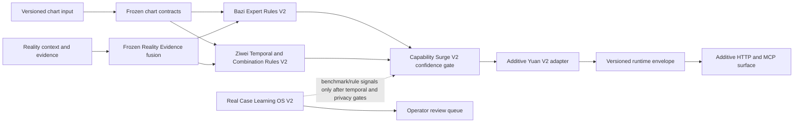

# MINGLI Core Capability Surge V2 Architecture

Status: **FROZEN BASELINE / IMPLEMENTATION CONTRACT**  
Baseline main SHA: `00eeaad66a2a36684ae2ad0b5b0074fcdf700640`  
Release Hold: **ACTIVE**  
Prediction boundary: `prediction_validity=not_evaluated`

## Purpose

MINGLI_CORE_CAPABILITY_SURGE_V2 extends the deterministic MingLi core through additive, versioned modules. It must not rewrite the public contracts merged through PR #30, weaken Reality Evidence precedence, treat synthetic fixtures as proof of accuracy, or authorize a release.

## Non-goals

- No publication, tag, PyPI upload, or Release Hold removal.
- No deterministic claim where the current inputs or traditional rule coverage are unsupported.
- No use of model-generated text, predictions, or synthetic fixtures as Reality Evidence.
- No mutation of frozen v1/v2.0 contracts. New behavior is exposed through versioned V2 contracts.

## Frozen contract groups

The machine-readable source of truth is `src/mingli/contracts/frozen/mingli_core_capability_surge_v2.json`. The verifier checks raw-byte SHA-256 digests. Additional versioned files are allowed; changing, deleting, or path-replacing a frozen file fails closed.

| Group | Public responsibility | Required invariant |
| --- | --- | --- |
| chart | Bazi and Ziwei inputs, normalized charts, fingerprints, conventions | Unknown or degraded time data remains explicit; canonical serialization is deterministic |
| rule | Rule-card and phase contract shapes, priorities, conflicts, coverage semantics | Unsupported facts never enter evaluation; content coverage is not accuracy |
| evidence | Prediction snapshots, outcomes, comparable claims, Reality Evidence fusion | Verified Reality Evidence hard-overrides only the same claim and scope; conflicts remain visible |
| case | Consent, anonymization, withdrawal, review and dataset records | Real stores remain off-Git; withdrawal invalidates derived records |
| benchmark | Golden/static/real-case registry and deterministic benchmark behavior | Synthetic fixtures prove contracts only and are excluded from product accuracy claims |
| runtime | Runtime envelopes, service inputs/outputs, release authorization | Inputs are validated at the boundary; no hidden network or storage side effects |
| renderer | Yuan controlled-language contract and domain output shape | One disclaimer, no absolute promises, no internal rule IDs or hidden scores |

## System data flow



## Workstream boundaries

### A — Bazi Expert Rules V2

A composes the existing Phase 9–17 structures and Phase 18 evidence fusion. Its public result must separately expose:

- five-element strength and same-kind/different-kind proportions;
- pattern, yongshen and climate-regulation candidates;
- ten-god combinations and branch relation summaries;
- decadal, annual and monthly temporal scopes;
- career, wealth, relationship, marriage, study, family and compatibility domains;
- civil-service exam facets: system fit, exam conditions, role direction and preparation strategy;
- relationship-reunion facets: attraction, contact, reunion and stability conditions;
- dual-person baseline compatibility and prior-event validation;
- calibrated confidence, scoped Reality Evidence overrides and Yuan output.

A must preserve candidate/conditional wording where the frozen phases do not authorize concrete events.

### B — Ziwei Temporal and Combination Rules V2

B is an additive evaluator over a complete, compatible Ziwei chart. It covers four-transformation combinations, primary/supporting-star combinations, three-directions/four-orthogonals, sandwich/arch/convergence/aspect relations, life/body-palace relations, brightness/state combinations, decade/year/month overlays, domain topics and bounded event windows.

Every rule has a behavioral trigger, exclusion, conflict key, priority and provenance. Unsupported or degraded chart fields fail closed. Mutation and false-pass probes must demonstrate that a record cannot count as covered unless its trigger and exclusion paths are behaviorally exercised.

### C — Real Case Learning OS V2

C composes existing intake, privacy, prediction-freeze, training-store and review contracts. Its lifecycle is:

1. intake and explicit consent;
2. irreversible anonymization and off-Git storage;
3. chart snapshot, original question and prediction-time reality context;
4. frozen initial prediction and prior-event validation;
5. future outcome observation;
6. hit / partial / miss / unverifiable adjudication;
7. error taxonomy, rule attribution and revision proposal;
8. benchmark-version comparison;
9. rule promotion/demotion recommendation;
10. negative-case archive and operator review.

Train/test assignment is based on event and observation time, not ingestion order. The same person, prediction, event window, derived record or near-duplicate fingerprint may not cross partitions. Withdrawal removes all dependent records. Synthetic records are always marked and are never accuracy-eligible.

## Architectural decisions

### D1 — Hash-freeze the merged baseline

Decision: freeze named public files by repository-relative path and raw-byte SHA-256.

Rationale: the three workstreams can evolve independently while any accidental contract drift is detected before integration.

Rejected alternative: rely only on semantic tests. Semantic tests can miss renamed fields, default changes and serialization drift.

### D2 — Additive V2 modules

Decision: add versioned modules and schemas; do not edit frozen implementation contracts.

Rationale: this keeps PR #30 consumers stable and makes integration order explicit.

Rejected alternative: extend v1 modules in place. That would make patch review and rollback ambiguous.

### D3 — Reality Evidence has hard precedence

Decision: verified Reality Evidence overrides only a matching `claim_id + scope`. Conflicting verified reality yields unresolved/low confidence.

Rationale: a chart-derived tendency cannot overrule observed reality.

Rejected alternative: blend Reality Evidence into a weighted average. That permits deterministic-looking output to contradict known facts.

### D4 — Unsupported means fail closed

Decision: unknown schema versions, degraded inputs used as complete facts, missing temporal boundaries, unsupported rule features and leakage risks return explicit unsupported/unresolved results or raise a typed boundary error.

Rejected alternative: skip unknown fields and continue. Silent skipping creates false passes and overstated coverage.

### D5 — Confidence is calibrated by evidence quality

Decision: structural-only results are capped, unresolved conflicts are low, and high confidence is limited to verified scope-specific reality. Confidence labels and scores must remain internally consistent.

### D6 — Learning is review-gated and temporally separated

Decision: case outcomes produce review candidates, never automatic rule promotion. Promotion/demotion requires operator review, minimum evidence policy and a leakage-clean temporal benchmark comparison.

### D7 — Renderer remains controlled language

Decision: the V2 adapter maps new domains into the frozen Yuan semantics without exposing internal scores, rule IDs, guarantees or duplicate disclaimers.

### D8 — Release Hold remains active

Decision: engineering completeness, behavioral coverage and green CI do not establish real-world predictive accuracy. Only an independent authorization over a frozen, reproducible, qualified real-case dataset may reassess the hold.

## Integration contract

The integration branch is `integration/mingli-core-capability-surge-v2`. Merge order is fixed:

1. frozen contracts;
2. Bazi V2;
3. Ziwei V2;
4. Real Case Learning OS V2;
5. runtime and renderer integration.

Each merge must preserve the frozen manifest, canonical hashes and `prediction_validity` boundary. Integration adds a versioned orchestrator and additive HTTP/MCP surface; it does not modify the frozen service contract.

## Verification contract

Required gates:

- schema validation;
- focused, contract, golden and property tests;
- mutation and false-pass tests;
- fast, benchmark and real-case gates;
- full pytest and compileall;
- configured static/type checks;
- wheel and sdist;
- installed-wheel, HTTP and MCP smoke tests;
- pip-audit;
- whitespace, credential, local-path, fail-open, disabled-test and generated-artifact scans;
- three adversarial review themes with independent dual-review convergence.

A gate result is valid only when its command, commit SHA and outcome are recorded in the verification report.

## Release assessment

This architecture cannot clear any existing hold. Until authorized real cases pass consent, privacy, temporal separation, independent review and reproducible benchmark gates:

```text
PRODUCT_RELEASE_HOLD_REMAINS
prediction_validity=not_evaluated
```

